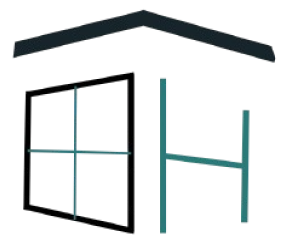

<!-- Improved compatibility of back to top link: See: https://github.com/othneildrew/Best-README-Template/pull/73 -->
<a id="readme-top"></a>
<!--
*** Thanks for checking out the Best-README-Template. If you have a suggestion
*** that would make this better, please fork the repo and create a pull request
*** or simply open an issue with the tag "enhancement".
*** Don't forget to give the project a star!
*** Thanks again! Now go create something AMAZING! :D
-->


<!-- PROJECT SHIELDS -->
<!--
*** I'm using markdown "reference style" links for readability.
*** Reference links are enclosed in brackets [ ] instead of parentheses ( ).
*** See the bottom of this document for the declaration of the reference variables
*** for contributors-url, forks-url, etc. This is an optional, concise syntax you may use.
*** https://www.markdownguide.org/basic-syntax/#reference-style-links
-->
[![Contributors][contributors-shield]][contributors-url]
[![Forks][forks-shield]][forks-url]
[![Stargazers][stars-shield]][stars-url]
[![Issues][issues-shield]][issues-url]
[![MIT License][license-shield]][license-url]
[![LinkedIn][linkedin-shield]][linkedin-url]


<!-- PROJECT LOGO -->
<br />
<div align="center">
  <a href="https://github.com/JunSayke/Huntify">
    
  </a>

<h3 align="center">Huntify</h3>

  <p align="center">
    project_description
    <br />
    <a href="https://github.com/JunSayke/Huntify"><strong>Explore the docs »</strong></a>
    <br />
    <br />
    <a href="https://github.com/JunSayke/Huntify">View Demo</a>
    ·
    <a href="https://github.com/JunSayke/Huntify/issues/new?labels=bug&template=bug-report---.md">Report Bug</a>
    ·
    <a href="https://github.com/JunSayke/Huntify/issues/new?labels=enhancement&template=feature-request---.md">Request Feature</a>
  </p>
</div>


<!-- TABLE OF CONTENTS -->
<details>
  <summary>Table of Contents</summary>
  <ol>
    <li>
      <a href="#about-the-project">About The Project</a>
      <ul>
        <li><a href="#built-with">Built With</a></li>
      </ul>
    </li>
    <li>
      <a href="#getting-started">Getting Started</a>
      <ul>
        <li><a href="#prerequisites">Prerequisites</a></li>
        <li><a href="#installation">Installation</a></li>
      </ul>
    </li>
    <li><a href="#usage">Usage</a></li>
    <li><a href="#roadmap">Roadmap</a></li>
    <li><a href="#contributing">Contributing</a></li>
    <li><a href="#license">License</a></li>
    <li><a href="#contact">Contact</a></li>
    <li><a href="#acknowledgments">Acknowledgments</a></li>
  </ol>
</details>


<!-- ABOUT THE PROJECT -->
## About The Project

[![Product Name Screen Shot][product-screenshot]](https://example.com)

Huntify is designed to simplify property management tasks. It provides a user-friendly interface for managing properties, tenants, and leases. The system is built using modern web technologies to ensure a smooth and responsive user experience.

<p align="right">(<a href="#readme-top">back to top</a>)</p>


### Built With

* [![Django][Django.com]][Django-url]
* [![Tailwind][Tailwindcss.com]][Tailwind-url]
* [![HTML][HTML.com]][HTML-url]
* [![Javascript][Javascript.com]][Javascript-url]

<p align="right">(<a href="#readme-top">back to top</a>)</p>


<!-- GETTING STARTED -->
## Getting Started

This is an example of how you may give instructions on setting up your project locally.
To get a local copy up and running follow these simple example steps.

### Installation

1. Clone the repo
   ```sh
   git clone https://github.com/JunSayke/Huntify.git
   ```
2. Install Python packages
    ```sh
    pip install -r requirements.txt
    ```
3. Install Node packages in theme/static_src
    ```sh
    cd theme/static_src
    npm install
    cd ..\..\
    ```
4. Migrate database
    ```sh
   py manage.py makemigrations
   py manage.py migrate
   ```
5. Load necessary data
   ```sh
   py manage.py load_philippine_address_data
   py manage.py load_tags_data
   ```
6. Run the server
   ```sh
    py manage.py runserver
    ```

<p align="right">(<a href="#readme-top">back to top</a>)</p>


<!-- USAGE EXAMPLES -->
## Usage

Use this space to show useful examples of how a project can be used. Additional screenshots, code examples and demos work well in this space. You may also link to more resources.

_For more examples, please refer to the [Documentation](https://example.com)_

<p align="right">(<a href="#readme-top">back to top</a>)</p>


<!-- ROADMAP -->
## Roadmap

- [🛠] Authentication
    - [x] Sign Up
    - [x] Sign In
    - [x] Change Password
    - [ ] Forgot Password
    - [ ] Reset Password
    - [ ] Email Verification
    - [ ] Phone Verification
- [x] Profile
    - [x] View
    - [x] Edit
    - [x] Public Profile
- [x] Property Management
    - [x] Sortable Properties
    - [x] Searchable Properties
    - [x] Property Listings
    - [x] Boarding House
      - [x] Create
      - [x] View
      - [x] Update
      - [x] Delete
    - [x] Boarding Room
      - [x] Create
      - [x] View
      - [x] Update
      - [x] Delete
    - [x] Tenant Management
      - [x] Check-out
- [x] Booking Management
    - [x] Booking
        - [x] Request
        - [x] View
        - [x] Approve
        - [x] Reject
        - [x] Check-in
- [ ] Notification
    - [ ] Booking Notification
        - [ ] Create
        - [ ] View
        - [ ] Delete
- [ ] Review
    - [x] Review Property
        - [x] Create
        - [x] View
        - [ ] Delete
        - [x] Update

See the [open issues](https://github.com/JunSayke/Huntify/issues) for a full list of proposed features (and known issues).

<p align="right">(<a href="#readme-top">back to top</a>)</p>


<!-- CONTRIBUTING -->
## Contributing

Contributions are what make the open source community such an amazing place to learn, inspire, and create. Any contributions you make are **greatly appreciated**.

If you have a suggestion that would make this better, please fork the repo and create a pull request. You can also simply open an issue with the tag "enhancement".
Don't forget to give the project a star! Thanks again!

1. Fork the Project
2. Create your Feature Branch (`git checkout -b feature/AmazingFeature`)
3. Commit your Changes (`git commit -m 'Add some AmazingFeature'`)
4. Push to the Branch (`git push origin feature/AmazingFeature`)
5. Open a Pull Request

<p align="right">(<a href="#readme-top">back to top</a>)</p>

### Top contributors:

<a href="https://github.com/JunSayke/Huntify/graphs/contributors">
  
</a>


<!-- LICENSE -->
## License

Distributed under the MIT License. See `LICENSE.txt` for more information.

<p align="right">(<a href="#readme-top">back to top</a>)</p>


<!-- CONTACT -->
## Contact

Your Name - [@twitter_handle](https://twitter.com/twitter_handle) - email@email_client.com

Project Link: [https://github.com/JunSayke/Huntify](https://github.com/JunSayke/Huntify)

<p align="right">(<a href="#readme-top">back to top</a>)</p>


<!-- ACKNOWLEDGMENTS -->
## Acknowledgments

* [Flowbite](https://flowbite.com)
* [Font Awesome](https://fontawesome.com)
* [django-formtools](https://django-formtools.readthedocs.io/)
* [django-tailwind](https://github.com/timonweb/django-tailwind)
* [prettier-plugin-django](https://github.com/junstyle/prettier-plugin-django)
* [prettier-plugin-tailwindcss](https://github.com/tailwindlabs/prettier-plugin-tailwindcss)
* [django-widget-tweaks](https://github.com/jazzband/django-widget-tweaks)
* [django-crispy-forms](https://django-crispy-forms.readthedocs.io/en/latest/)
* [crispy-tailwind](https://github.com/django-crispy-forms/crispy-tailwind)
* [Best-README-Template](https://github.com/othneildrew/Best-README-Template/tree/main)

<p align="right">(<a href="#readme-top">back to top</a>)</p>


<!-- MARKDOWN LINKS & IMAGES -->
<!-- https://www.markdownguide.org/basic-syntax/#reference-style-links -->
[contributors-shield]: https://img.shields.io/github/contributors/JunSayke/Huntify.svg?style=for-the-badge
[contributors-url]: https://github.com/JunSayke/Huntify/graphs/contributors
[forks-shield]: https://img.shields.io/github/forks/JunSayke/Huntify.svg?style=for-the-badge
[forks-url]: https://github.com/JunSayke/Huntify/network/members
[stars-shield]: https://img.shields.io/github/stars/JunSayke/Huntify.svg?style=for-the-badge
[stars-url]: https://github.com/JunSayke/Huntify/stargazers
[issues-shield]: https://img.shields.io/github/issues/JunSayke/Huntify.svg?style=for-the-badge
[issues-url]: https://github.com/JunSayke/Huntify/issues
[license-shield]: https://img.shields.io/github/license/JunSayke/Huntify.svg?style=for-the-badge
[license-url]: https://github.com/JunSayke/Huntify/blob/master/LICENSE.txt
[linkedin-shield]: https://img.shields.io/badge/-LinkedIn-black.svg?style=for-the-badge&logo=linkedin&colorB=555
[linkedin-url]: https://linkedin.com/in/linkedin_username
[product-screenshot]: huntify_project/static/images/initial_sample.png
[Next.js]: https://img.shields.io/badge/next.js-000000?style=for-the-badge&logo=nextdotjs&logoColor=white
[Next-url]: https://nextjs.org/
[React.js]: https://img.shields.io/badge/React-20232A?style=for-the-badge&logo=react&logoColor=61DAFB
[React-url]: https://reactjs.org/
[Vue.js]: https://img.shields.io/badge/Vue.js-35495E?style=for-the-badge&logo=vuedotjs&logoColor=4FC08D
[Vue-url]: https://vuejs.org/
[Angular.io]: https://img.shields.io/badge/Angular-DD0031?style=for-the-badge&logo=angular&logoColor=white
[Angular-url]: https://angular.io/
[Svelte.dev]: https://img.shields.io/badge/Svelte-4A4A55?style=for-the-badge&logo=svelte&logoColor=FF3E00
[Svelte-url]: https://svelte.dev/
[Laravel.com]: https://img.shields.io/badge/Laravel-FF2D20?style=for-the-badge&logo=laravel&logoColor=white
[Laravel-url]: https://laravel.com
[Bootstrap.com]: https://img.shields.io/badge/Bootstrap-563D7C?style=for-the-badge&logo=bootstrap&logoColor=white
[Bootstrap-url]: https://getbootstrap.com
[Django-url]: https://www.djangoproject.com/
[Django.com]: https://img.shields.io/badge/Django-092E20?style=for-the-badge&logo=django&logoColor=white
[Tailwind-url]: https://tailwindcss.com/
[Tailwindcss.com]: https://img.shields.io/badge/Tailwind_CSS-38B2AC?style=for-the-badge&logo=tailwind-css&logoColor=white
[HTML-url]: https://html.com/
[HTML.com]: https://img.shields.io/badge/HTML5-E34F26?style=for-the-badge&logo=html5&logoColor=white
[Javascript-url]: https://www.javascript.com/
[Javascript.com]: https://img.shields.io/badge/JavaScript-F7DF1E?style=for-the-badge&logo=javascript&logoColor=black

## Links

* [Functional Requirements](https://docs.google.com/document/d/14mLl-L_vZucTNhNoaw4kb9tvV6GuLXDF/edit?usp=sharing&ouid=115092322264620102026&rtpof=true&sd=true)

* [Gantt Chart](https://docs.google.com/spreadsheets/d/1m0sIULdKtLc0mwcAXXSBM2OfzEvyhS7mwGWxavCypq0/edit?usp=sharing)

* [ERD](https://online.visual-paradigm.com/share.jsp?id=333030323935352d38#diagram:workspace=uhrbhlrf&proj=0&id=8)

* [Figma](https://www.figma.com/design/lJtAD6inX1gucTBZH60YUz/Huntify-Prototype?node-id=0-1&node-type=canvas&t=xFOIgf7iYVAwB4Jv-0)

<p align="right">(<a href="#readme-top">back to top</a>)</p>
